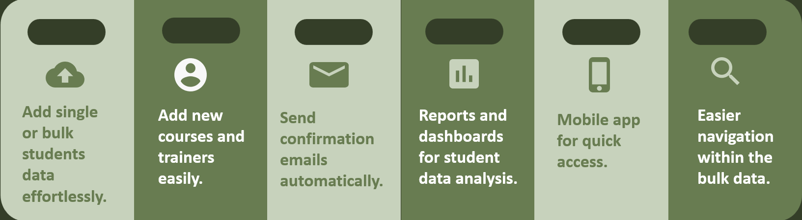
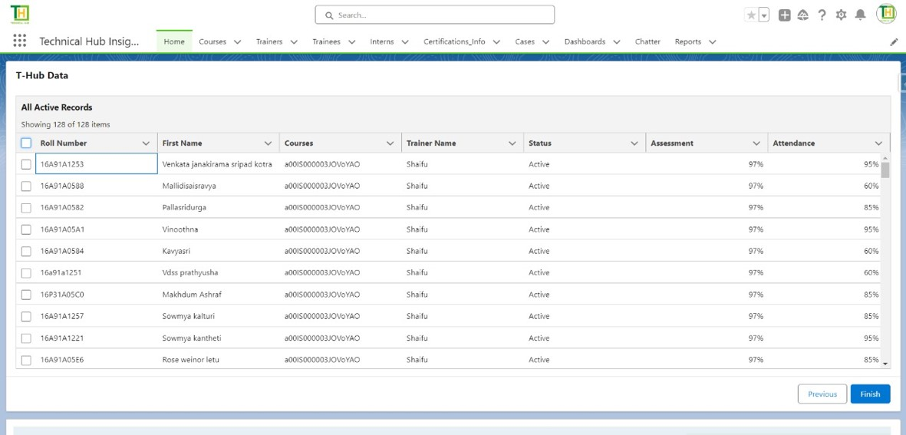
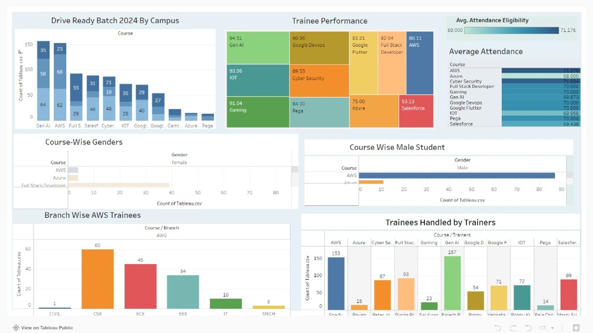
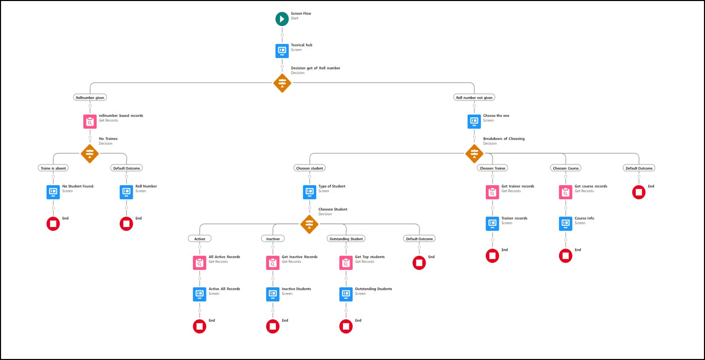
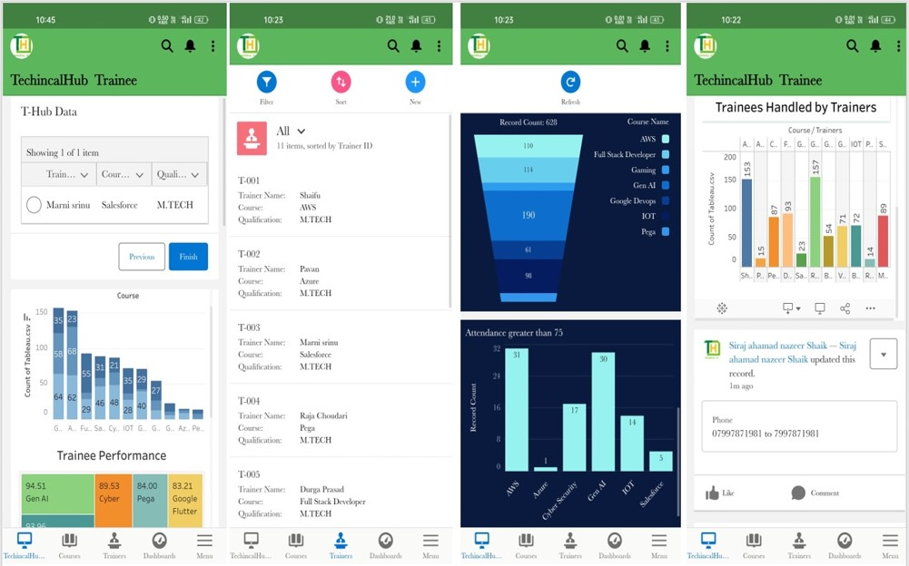
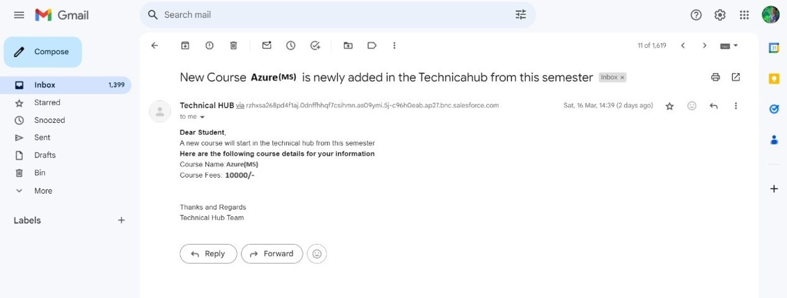
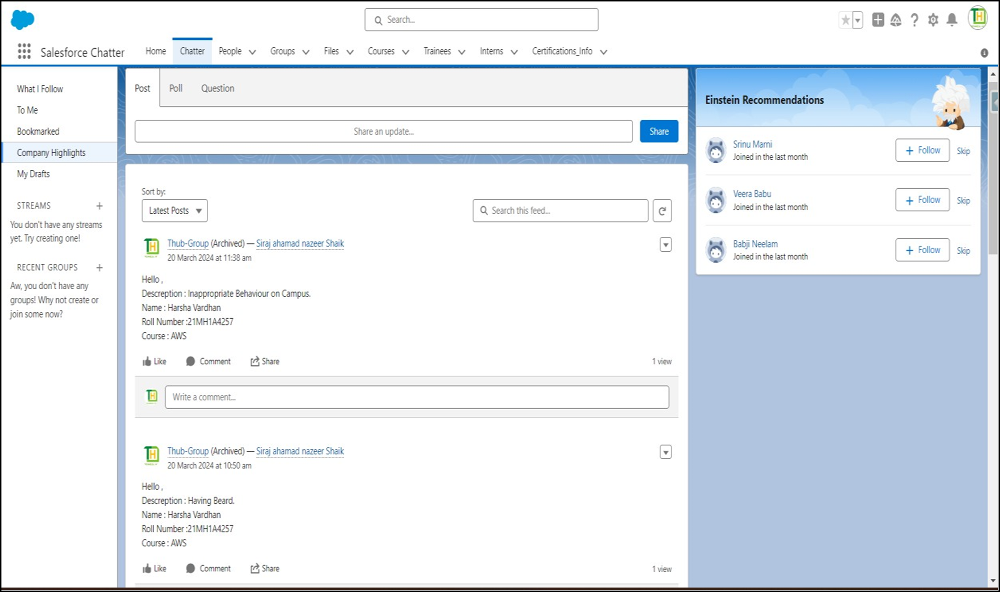

# Salesforce-Data-Visualization

## Salesforce Data Visualization Project

This project demonstrates my Salesforce administration skills by creating a centralized platform for data visualization and managing technical skills synchronization with students. 
I used custom workflows, [dataloader.io](https://www.dataloader.io/), Apex for automated emails, reports, and dashboards to automate processes and enhance reporting accuracy.

## Features
- **Custom Objects**: Courses, Trainers, Trainees, Interns, Certification_Info.
- **Bulk Data Loading**: Over **10,000+ records** loaded into org using [dataloader.io](https://www.dataloader.io/).
- **Automated Workflows**: Created custom workflows to automate email alerts, task creation, and record updates.
- **Dashboards**: Used Salesforce’s built-in reporting features to create detailed dashboards for better insights.
- **Tableau Integration**: Integrated [Tableau](https://www.tableau.com/) for enhanced visualization, improving data analysis by **50%**.
- **Mobile App**: Mobile app for quick access.

## Screenshots
-   
  **Overview of Main Features**: Displays primary functionalities, including data import, reporting, and automation.
  
-   
  **Data Sync Overview**: Screenshot showcasing bulk data import through *dataloader.io*, with seamless record synchronization.
  
-   
  **Insight Analytics Dashboard**: Interactive dashboard powered by Tableau, providing visual insights into skill management data.
  
-   
  **User Compliance Flow**: Automated workflow screen, ensuring users meet compliance standards (ID verification, behavior check, etc.).
  
-   
  **Salesforce Integrated App**: Mobile app screenshot, providing quick access to real-time data visualizations and reports and many other features.
  
-   
  **Automated Email Notification System**: Automatic email alert setup, keeping users informed on key updates.
  
-   
  **Org-Wide Collaboration Feed**: Salesforce Chatter screenshot, enabling organization-wide collaboration and team engagement.

## Tools Used
- **Salesforce Admin**
- **Apex**
- **Tableau**

## Contact
Feel free to reach out to me at [saisindusri@gmail.com](mailto:saisindusri@gmail.com) for any questions or collaboration opportunities.
